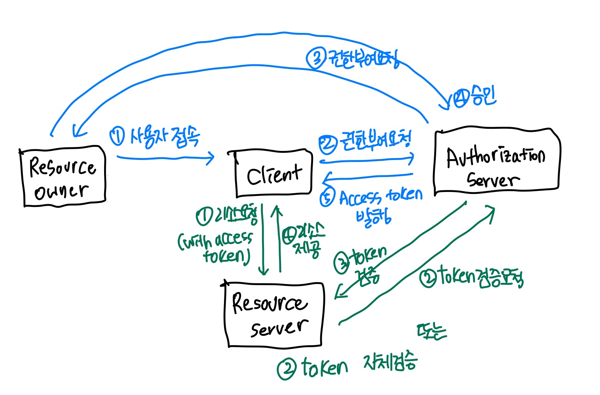
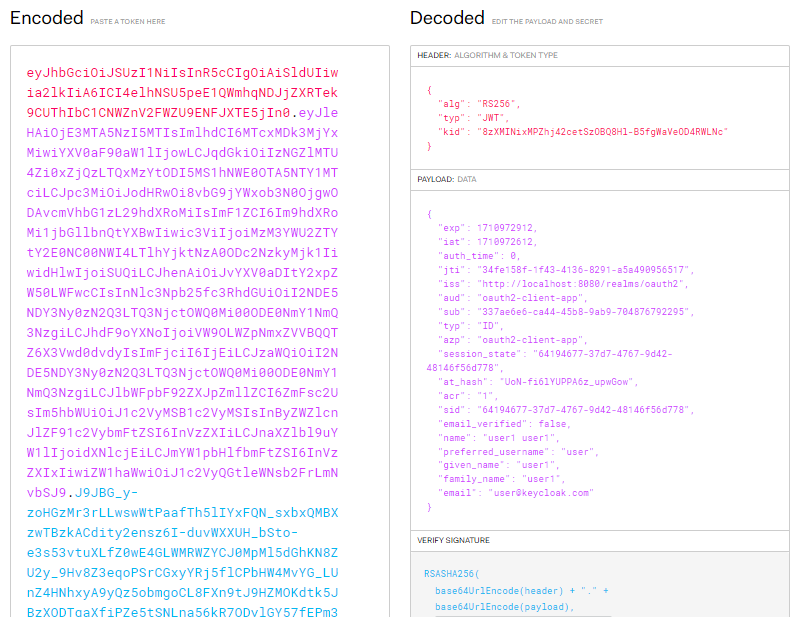

# ✨ Spring Security OAuth2
- Spring Security OAuth2 공부 중 입니다!
- 관련 강의 : [스프링 시큐리티 OAuth2](https://inf.run/o6Xn)

## ⭐ 목차
- [⭐ 개발 환경](#-개발-환경)
- ⭐ [Spring Security 인증 및 인가](#-spring-security-인증-및-인가-요약)
  - [1-1. Security Builder](/docs/1-1.Security%20Builder.md)
  - [1-2. AutoConfiguration](/docs/1-2.AutoConfiguration.md)
  - [1-3. AuthenticationEntryPoint](/docs/1-3.AuthenticationEntryPoint.md)
- ⭐ [OAuth 2.0 Roles](#-oauth-20-roles-요약)
  - [2-0. Keycloak 설치 및 설정](/docs/2-0.Keycloak%20설치%20및%20설정.md)
  - [2-1. OAuth2.0 Roles](/docs/2-1.OAuth2.0%20Roles.md)
  - [2-2. OAuth2.0 Client Types](/docs/2-2.OAuth2.0%20Client%20Types.md)
  - [2-3. OAuth2.0 Token Types](/docs/2-3.OAuth2.0%20Token%20Types.md)
- ⭐ [OAuth 2.0 Grant Types](#-oauth-20-grant-types-요약)
  - [2-4. OAuth2.0 Grant Types](/docs/2-4.OAuth2.0%20Grant%20Types.md)
- ⭐ [OAuth 2.0 OpenID Connect](#-oauth-20-openid-connect)


## ⭐ 개발 환경
- SpringBoot version `2.7.18`
- Java version `17`
- Build : Gradle
- Dependency 추가
  - spring-boot-starter-web 
  - spring-boot-starter-security
  - lombok

## ⭐ Spring Security 인증 및 인가 요약

1. DelegatingFilterProxy가 `springSecurityFilterChain` Bean을 찾음
    ```java
    @Override
	  public void doFilter(ServletRequest request, ServletResponse response, FilterChain filterChain)
			throws ServletException, IOException {

      //...
      //springSecurityFilterChain bean을 찾고
      WebApplicationContext wac = findWebApplicationContext();
      delegateToUse = initDelegate(wac);

      // Let the delegate perform the actual doFilter operation.
      invokeDelegate(delegateToUse, request, response, filterChain);
	}
    ```
2. FilterChainProxy.java에서 filter chain에 등록 된 filter 실행
    ```java
    @Override
    public void doFilter(ServletRequest request, ServletResponse response) throws IOException, ServletException {
      //...
      Filter nextFilter = this.additionalFilters.get(this.currentPosition - 1);
      nextFilter.doFilter(request, response, this);
      }
    ```
3. `ExceptionTranslationFilter`에서 `AccessDenided` -> throw ex
  
4. 다시 `DelegatingFilterProxy` -> `DefaultLoginPageGeneratingFilter` 실행 -> '/login' entry point -> 로그인 form화면 -> 로그인정보 입력
5. `DelegatingFilterProxy` -> `UsernamePasswordAuthenticationFilter` 실행
   - username과 password를 저장하여 `Authentication` 객체 반환
6. ProviderManager에서 인증처리 할 수 있는 클래스(AbstractUserDetailsAuthenticationProvider) 찾아서 위임 
7. `AbstractUserDetailsAuthenticationProvider`에서 인증 성공/실패 처리
   - `UserDetails` 객체 반환
     
8. ProviderManager는 인증 성공 시 `Authentication` 객체에 UserDetails 정보 저장 
9. `SecurityContext`에 전역적으로 인증받았다는 정보 저장
  

# ⭐ OAuth 2.0 Roles 요약


### ✨ Resource Owner (사용자)
- 보호된 자원에 대한 접근 권한을 부여할 수 있는 주체
- 계정의 일부에 대한 접근 권한을 부여 하는 사람
- 사용자를 대신하여 작용하려는 모든 클라이언트는 사용자의 허가 받아야 함.

### ✨ Resource Server
- 사용자의 자원을 가지고 있는 서버
- 엑세스 토큰 수락 및 검증
- 권한 체계에 따라 요청 승인

### ✨ Authorization Server
- 클라이언트에게 권한 부여 승인 또는 거부하는 서버
- 인가서버가 사용자에게 클라이언트에 대한 권한 부여 요청을 받아서
- 클라이언트에게 엑세스 토큰을 부여함

### ✨ Client
- 사용자를 대신하여 권한을 부여받아 사용자의 리소스에 접근하려는 어플리케이션

# ⭐ OAuth 2.0 Grant Types 요약

### ✨ Authorization Code
- 사용자의 인증 및 동의 후 인가서버는 클라이언트에게 Code를 응답
- 클라이언트는 코드를 보내 인가서버로부터 Access Token을 발급 받음

### ✨ Implicit (Deprecated)
- 사용자의 인증 및 동의 후 인가서버는 클라이언트에게 Access Token을 응답
- 브라우저에 Access Token 노출되므로 보안에 취약함

### ✨ Resource Owner Password Credentials (Deprecated)
- 사용자의 ID와 password를 통해 권한 부여를 받음 
- 사용자의 ID와 Password가 브라우저에 노출되므로 보안에 취약함
- 또한 클라이언트가 사용자 ID, Password를 알고있으므로 신뢰성 높은 자사 애플리케이션 등에서만 사용하는 방식

### ✨ Client Credentials
- 클라이언트의 ID, Secret만 있으면 인가서버로부터 Token 발급 받음
- 사용자가 클라이언트임

### ✨ Refresh Token
- Access Token 만료 시 Refresh Token으로 Access Token을 재발급 받음
- Refresh Token이 유효하다면 인증과정을 처음부터 반복하지 않아도 Access Token을 재발급 받을 수 있음
- 한번 사용된 Refresh Token은 폐기되거나 재사용 할 수 있음

### ✨ PKCE-Enhanced Authorization Code
- Authorization Code Grant Type 의 확장 버전
- Code Verifier 와 Code Challenge를 추가하여 Code가 탈취당했을 때 Access Token을 발급하지 못하도록 차단
- Code 요청시에는 Code Challenge, Code Challenge Method 포함하여 요청
- Access Token 요청시에는 Code Verifier 포함하여 요청

# ⭐ OAuth 2.0 OpenID Connect
- OAuth 2.0 프로토콜 위에 구축된 ID 계층 `인증 프로토콜`
- scope 지정 시 `openid` 를 포함하면 OpenID Connect 사용이 가능
- 인증에 대한 정보는 `ID 토큰`이라고 하는 JWT로 반환
- (참고) OAuth2.0은 `인가 프레임워크`
- ID Token Decoding
  