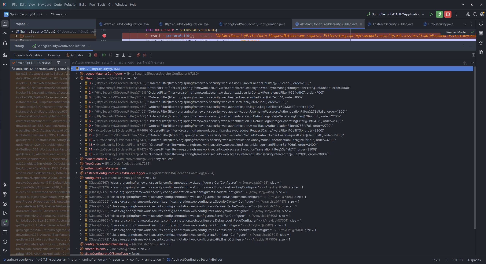

## Security Builder
### ✨ Bean 객체와 설정 클래스 생성
- WebSecurity, HttpSecurity
- Security Configurer : Http 요청과 관련 된 보안을 담당하는 필터들을 생성하고 초기화 (인증 및 인가 초기화)
- apply(SecurityConfigure) : 초기화 대상 생성 및 적용
- build() : 여러개의 메서드가 순서대로 호출 됨
- 이 때 init(B Builder), configure(B Builder) 가 호출되며, 인증, 인가에 필요한 필터 생성
- WebSecurity 클래스의 반환값 -> FilterChainProxy 생성
- HttpSecurity 클래스의 반환값 -> SecurityFilterChain 생성
- FilterChainProxy가 SecurityFilterChain의 값을 가지고 있음

### ✨ 작동 순서
1. WebSecurityConfiguration 진입
    ```java
    @Autowired(required = false)
    public void setFilterChainProxySecurityConfigurer(
            ObjectPostProcessor<Object> objectPostProcessor,
            ConfigurableListableBeanFactory beanFactory) throws Exception{
        ...
        //반복문을 돌면서 apply() 메서드 적용
        for(SecurityConfigurer<Filter, WebSecurity> webSecurityConfigurer:webSecurityConfigurers){
        this.webSecurity.apply(webSecurityConfigurer);
        }
        this.webSecurityConfigurers=webSecurityConfigurers;
        ...
    }
    ```
2. AbstractConfiguredSecurityBuilder 에서 doBuild()
    ```java
    @Override
    protected final O doBuild() throws Exception {
    synchronized (this.configurers) {
        this.buildState = BuildState.INITIALIZING;
        beforeInit();
        init();
        this.buildState = BuildState.CONFIGURING;
        beforeConfigure();
        configure();
        this.buildState = BuildState.BUILDING;
        O result = performBuild();
        this.buildState = BuildState.BUILT;
        return result;
        }
    }
    ```
3. HttpSecurityConfiguration 에서 각 configuration apply()
4. SpringBootWebSecurityConfiguration에서 filterChain 생성 -> 인증, 인가에 필요한 필터
    ```java
    @ConditionalOnDefaultWebSecurity
    static class SecurityFilterChainConfiguration {
    
      @Bean
      @Order(SecurityProperties.BASIC_AUTH_ORDER)
      SecurityFilterChain defaultSecurityFilterChain(HttpSecurity http) throws Exception {
        http.authorizeRequests().anyRequest().authenticated();
        http.formLogin();
        http.httpBasic();
        return http.build();
      }
    
    }
    ```
5. AbstractConfiguredSecurityBuilder 에서 doBuild()
6. WebSecurityConfiguration에서 filter Chain 적용 후 build()
    ```java
    @Bean(name = AbstractSecurityWebApplicationInitializer.DEFAULT_FILTER_NAME)
    public Filter springSecurityFilterChain() throws Exception {
      ...
      
     for (SecurityFilterChain securityFilterChain : this.securityFilterChains) {
       this.webSecurity.addSecurityFilterChainBuilder(() -> securityFilterChain);
       for (Filter filter : securityFilterChain.getFilters()) {
         if (filter instanceof FilterSecurityInterceptor) {
           this.webSecurity.securityInterceptor((FilterSecurityInterceptor) filter);
           break;
         }
       }
     }
     for (WebSecurityCustomizer customizer : this.webSecurityCustomizers) {
       customizer.customize(this.webSecurity);
     }
     return this.webSecurity.build();
   }
   ```

### ✨ 결과
- 초기화 후 default configuration, defualt filter 가짐
    