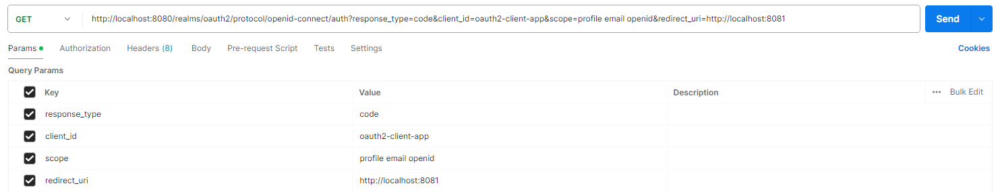
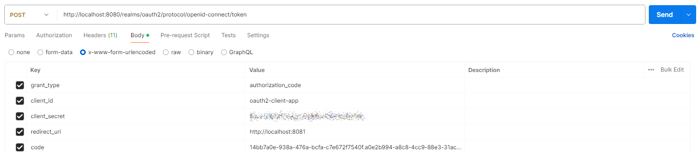
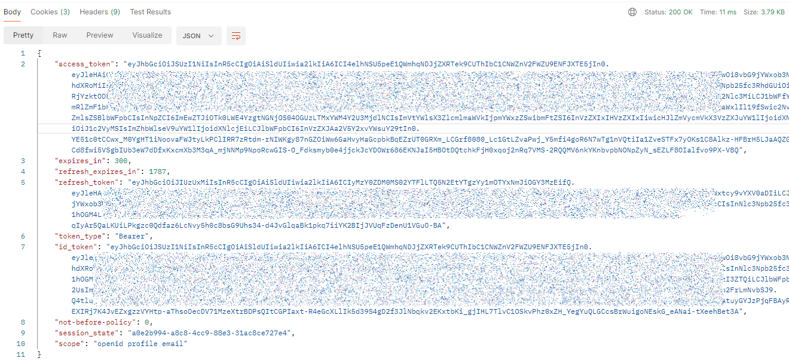
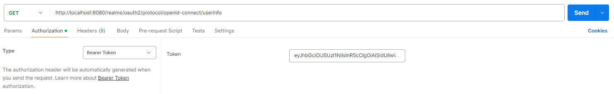
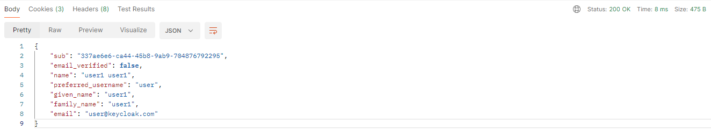

## Keycloak 설치 및 설정
### ✨ Keycloak 설치
- 인가서버 오픈소스
- https://www.keycloak.org/
```shell
$ keycloak-24.0.1\bin> .\kc.bat start-dev

...
[io.quarkus] (main) Keycloak 24.0.1 on JVM (powered by Quarkus 3.8.1) started in 10.040s. Listening on: http://0.0.0.0:8080
...
```

### ✨ Keycloak 설정
- Clients 만들기
```text
# General settings
## Client ID : oauth2-client-app

# Access settings
## Valid redirect URIs : http://localhost:8081

# Capability config
## Client authentication : On
## Authentication flow : Standard flow / Direct access grants / Implicit flow / Service accounts roles 

# Login settings
## Consent required : On

그외 설정 default 유지
```
- Users 만들기

### ✨ OpenID 방식 테스트
- client : postman, auth & resource server : keycloak
- `client`에서 `auth server`에 권한 부여 요청
  
  - 참고 : keycloak ver.에 따라 scope에 openid 반드시 추가 해 줄것!!
- `auth server`에서 로그인 할 수 있는 url을 `사용자(resource owner)`에게 redirect
- 사용자가 로그인을 하면 code 발급 (url 확인)
- `client`에서 code를 이용하여 access token 발급 요청
  
- `auth server`가 access token 발급
  
- `client`가 access token을 헤더에 심어서 `resource server`로 정보 요청
  
- `resource server` 응답
  

### ✨ 참고
- [OpenID Endpoint Configuration](./OpenID_Endpoint_Configuration.json)