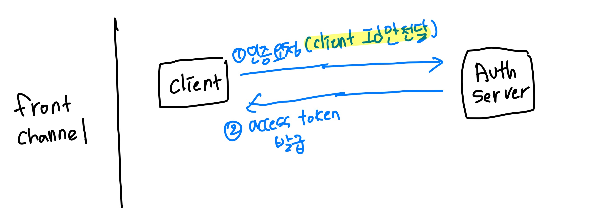
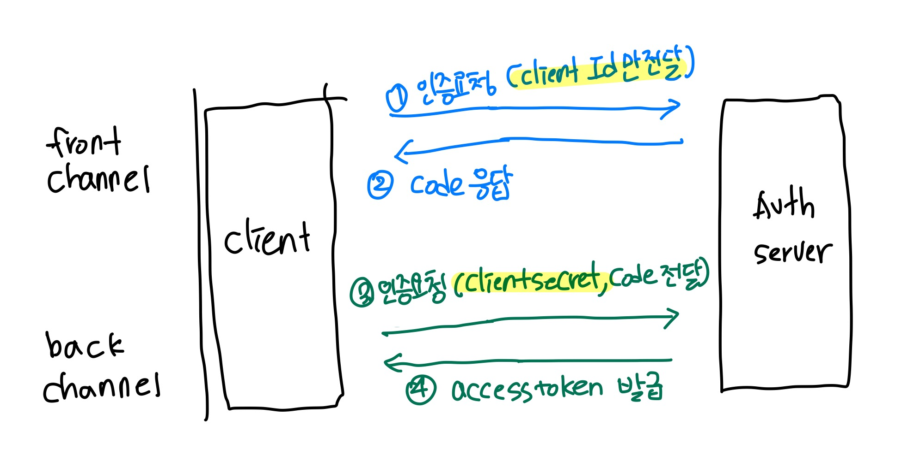

## OAuth 2.0 Client Types
- Client Secret은 비밀
- Client ID는 공개
- 인증 서버에 대한 `Client ID`를 증명함

### ✨ Confidential Clients : `Implicit flow` (deprecated)

- Client Secret의 기밀성 유지
- 서버에서 실행되는 애플리케이션 (Java, Node.JS 같은 서버 측 언어로 작성)
  - 일반적으로 사용자가 소스 코드에 엑세스 할 수 없음
- Test 할 때 resource type을 token으로 하면 => 응답이 token으로 옴

### ✨ Public Clients : `Authorization code flow`

- Client Secret의 기밀성 유지할 수 없으므로 secret 사용되지 않음
- 브라우저에서 실행되는 애플리케이션 (JavaScript 등 언어로 작성)
  - 콘솔 같은 디버깅 도구를 사용하여 소스 코드를 볼 수 있음
- Test는 2-0. OpenID Test 참조