## OAuth 2.0 Grant Types
- Access Token을 발급함으로써 권한부여를 함

### ✨ Authorization Code
```mermaid
sequenceDiagram
    Resource Owner->>Client: 서비스 접속
    Client->>+Authorization Server: authorization code 요청
    Note over Client,Authorization Server: GET /auth?response_type=code&client_id=[id]&scope=[scope]&redirect_uri=[uri]
    Authorization Server->>Resource Owner: 로그인 페이지
    Resource Owner->>Authorization Server: 로그인 접속
    Authorization Server->>Resource Owner: 동의하기(Consent) 페이지
    Resource Owner->>Authorization Server: 동의하기
    Authorization Server-->>-Client: authorization code 응답 리다이렉트
    Note over Client,Authorization Server: ...&code=[code]
    Client->>+Authorization Server: Access Token으로 교환 요청
    Note over Client,Authorization Server: POST /token, params: code, client_id, client_secret, grant_type, redirect_uri
    Authorization Server-->>-Client: Access Token, Refresh Token 응답
    loop Access Token 만료 시 까지
    Client->>+Resource Server: Access Token으로 API 호출
    Resource Server->>Authorization Server: Token 검증
    Authorization Server->>Resource Server: Token 검증 응답
    Resource Server-->>-Client: 요청 데이터 응답
    end
```
- 서버 사이드 어플리케이션에서 많이 사용 함
- 보안에 가장 안전함
- 클라이언트가 인가서버로부터 코드를 받음 (사용자의 승인 및 동의)
  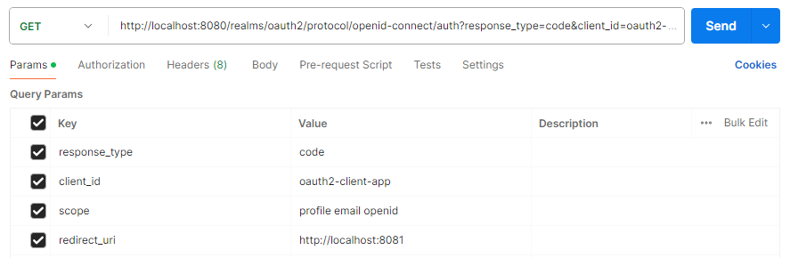
  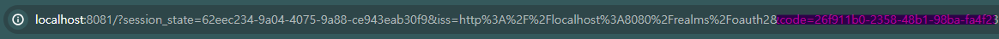
- 클라이언트가 인가서버에게 코드를 보낸 후
  
- 인가서버로부터 Access Token을 발급 받음

### ✨ Implicit (Deprecated)
```mermaid
sequenceDiagram
    Resource Owner->>Client: 서비스 접속
    Client->>+Authorization Server: Access Token 요청
    Note over Client,Authorization Server: GET /auth?response_type=token&client_id=[id]&scope=[scope]&redirect_uri=[uri]
    Authorization Server->>Resource Owner: 로그인 페이지
    Resource Owner->>Authorization Server: 로그인 접속
    Authorization Server->>Resource Owner: 동의하기(Consent) 페이지
    Resource Owner->>Authorization Server: 동의하기
    Authorization Server-->>-Client: Access Token 응답
    Note over Client,Authorization Server: /access_token=[token]
    Client->>Authorization Server: Token 검증
    Authorization Server->>Client: Token 검증 응답
    loop Access Token 만료 시 까지
    Client->>+Resource Server: Access Token으로 API 호출
    Resource Server-->>-Client: 요청 데이터 응답
    end
```
- 주로 공개 클라이언트 어플리케이션 (SPA 기반 자바스크립트 앱)에서 사용
- token을 바로 발급해주며 Access Token이 브라우저에 노출
  

### ✨ Resource Owner Password Credentials (Deprecated)
```mermaid
sequenceDiagram
    Resource Owner->>Client: 서비스 접속
    Client->>+Authorization Server: 인정정보(id/password) 포함하여 Access Token 요청
    Note over Client,Authorization Server: POST /token, params: username, password, client_id, client_secret, grant_type, dedirect_uri
    Authorization Server-->>-Client: Access Token, Refresh Token 응답
    loop Access Token 만료 시 까지
    Client->>+Resource Server: Access Token으로 API 호출
    Resource Server->>Authorization Server: Token 검증
    Authorization Server->>Resource Server: Token 검증 응답
    Resource Server-->>-Client: 요청 데이터 응답
    end
```
- 사용자의 ID와 password를 통해 권한 부여를 받음
  
- 사용자의 ID와 Password가 브라우저에 노출
- 클라이언트가 인가서버의 사용자 ID, Password를 알고있음
- 보통 신뢰성 높은 자사 어플리케이션에서 사용

### ✨ Client Credentials
```mermaid
sequenceDiagram
    Client->>+Authorization Server: Access Token 요청
    Note over Client,Authorization Server: POST /token, params: client_id, client_secret, grant_type=client_credentials
    Authorization Server-->>-Client: Access Token 응답
    loop Access Token 만료 시 까지
    Client->>+Resource Server: Access Token으로 API 호출
    Resource Server->>Authorization Server: Token 검증
    Authorization Server->>Resource Server: Token 검증 응답
    Resource Server-->>-Client: 요청 데이터 응답
    end
```
- 클라이언트의 ID, Secret만 있으면 인가서버로부터 Token 발급 받음
  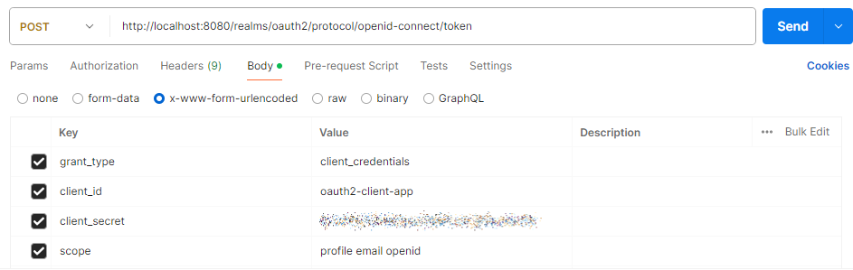
- 사용자가 없음 (백그라운드에서만 실행되는 어플리케이션 등)
- 사용자에 대한 응답이 다른 grant type과 다름 (사용자가 없기 때문에)
  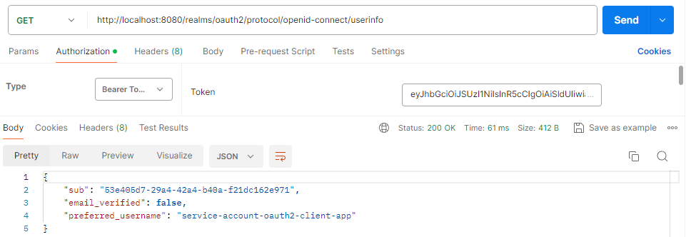

### ✨ Refresh Token
```mermaid
sequenceDiagram
    Client->>+Authorization Server: Access Token 요청
    Note over Client,Authorization Server: POST /token, params: client_id, client_secret, refresh_token, grant_type=refresh_token
    Authorization Server-->>-Client: Access Token 응답
    loop Access Token 만료 시 까지
      Client->>+Resource Server: Access Token으로 API 호출
      Resource Server->>Authorization Server: Token 검증
      Authorization Server->>Resource Server: Token 검증 응답
      Resource Server-->>-Client: 요청 데이터 응답
    end
    Client->>+Resource Server: Access Token으로 API 호출
    Resource Server-->>-Client: Token 만료
    Client->>+Authorization Server: Access Token 요청
    Note over Client,Authorization Server: POST /token, params: client_secret, refresh_token, grant_type=refresh_token
    Authorization Server-->>-Client: New Access Token & New Refresh Token 응답
```
- Authorization Code Type에서 지원
- Access Token 만료 시 Refresh Token으로 Access Token을 재발급 받음
  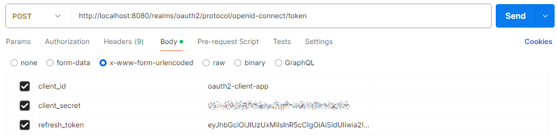
- Refresh Token이 유효하다면 인증과정을 처음부터 반복하지 않아도 Access Token을 재발급 받을 수 있음
- 한번 사용된 Refresh Token은 폐기되거나 재사용 할 수 있음
  - 보통 보안상 Refresh Token 도 새롭게 발급 받음

### ✨ PKCE-Enhanced Authorization Code
```mermaid
sequenceDiagram
    Resource Owner->>Client: 서비스 접속
    Client->>+Authorization Server: authorization code 요청
    Note over Client,Authorization Server: GET /auth?response_type=code&client_id=[id]&scope=[scope]&redirect_uri=[uri]&code_challenge=[]&code_challenge_method=S256
    Authorization Server->>Resource Owner: 로그인 페이지
    Resource Owner->>Authorization Server: 로그인 접속
    Authorization Server-->>-Client: authorization code 응답 리다이렉트
    Note over Client,Authorization Server: ...&code=[code]
    Client->>+Authorization Server: Access Token으로 교환 요청
    Note over Client,Authorization Server: POST /token, params: code, client_id, client_secret, grant_type, redirect_uri, code_verifier
    Authorization Server-->>-Client: Access Token, Refresh Token 응답
    loop Access Token 만료 시 까지
    Client->>+Resource Server: Access Token으로 API 호출
    Resource Server->>Authorization Server: Token 검증
    Authorization Server->>Resource Server: Token 검증 응답
    Resource Server-->>-Client: 요청 데이터 응답
    end
```
- Authorization Code Grant Type 의 확장 버전
- 권한부여코드 요청 시 Code Verifier 와 Code Challenge를 추가하여 Code가 탈취당했을 때 Access Token을 발급하지 못하도록 차단
---
#### 💜 코드 생성
- Code Verifier (해시 되기 전 값)
  - 권한부여코드 요청 전에 앱이 원래 생성한 PKCE 요청에 대한 코드 검증기
  - 43 ~ 128 글자수를 가진 무작위 문자열
  - AZaz09-._~ 의 ASCII 문자들로만 구성 됨
- Code Challenge (해시 + 인코딩 된 값)
  - 선택한 Hash 알고리즘으로 Code Verifier를 Hashing 한 후 Base64 인코딩 한 값
- Code Challenge Method
  - plain : Code Verifier가 특정 알고리즘을 사용하지 않도록 설정
  - S256 : Code Verifier가 해시 알고리즘을 사용하지 않도록 설정
---
#### 💜 처리 흐름
- Code 발급 받기 위한 단계
  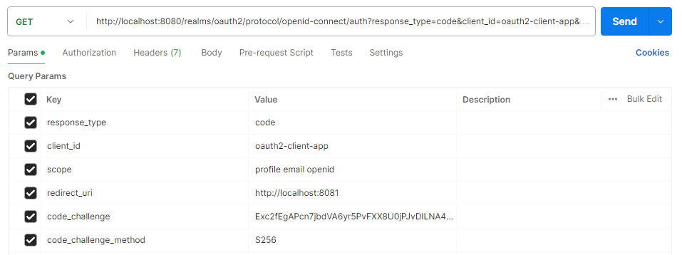
  - 클라이언트는 code verifier 생성, Code Challenge Method를 사용하여 Code Challenge 계산
  - 클라이언트가 인가서버에 Code Challenge Method, Code Challenge 포함하여 요청
  - 인가서버가 유효성 검증
  - 인가서버가 Code Challenge, Code Challenge Method의 존재를 확인
  - 인가서버가 권한 code에 대해 Code Challenge, Code Challenge Method 저장
  - 인가서버가 권한 code 응답 리턴
- Access Token 교환하기 위한 단계
  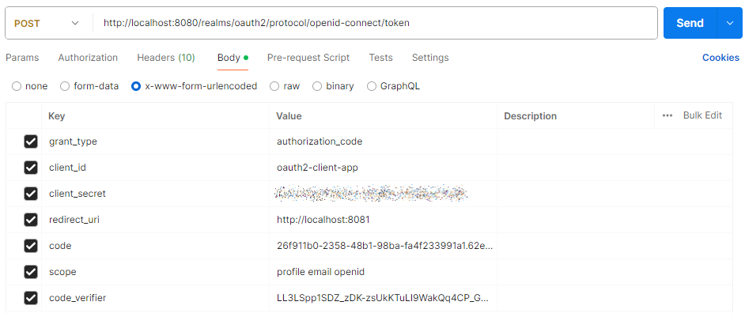
  - 클라이언트가 code verifier를 포함하여 Access token 요청
  - 인가서버가 유효성 검증
  - 인가서버는 code verifier 와 저장된 Code Challenge Method를 사용하여 Code Challenge 계산
  - 인가서버는 계산 된 Code Challenge와 초기 요청에서 저장한 Code Challenge 를 비교하여 Access token 발급여부 결정
- [(참고) Code Verifier 생성하는 사이트](https://tonyxu-io.github.io/pkce-generator/)

### ✨ parameter type
- 클라이언트가 인가서버에게 권한 부여 요청을 할때 전달하는 파라미터
- client_id : 클라이언트가 인가 서버에 등록 할 때 생성하는 키
- client_secret : Auth server에 등록 된 특정 클라이언트의 client_id에 대한 비밀값
- response_type : code / token / id_token => 서버가 쿼리 문자열에 반환
- grant_type : authorization_code / password  / client_credentials / refresh_token
- redirect_uri : 사용자가 인증에 성공하면, 인가 서버가 리다이렉션
- scope : 접근 범위 지정, profile / email / read / write / ...
- state : CSRF 공격 방지를 위해 사용, 클라이언트가 인가서버에 state를 보내고, 서버가 리다이렉트 할때 state를 받아서 동일한 값인지 확인