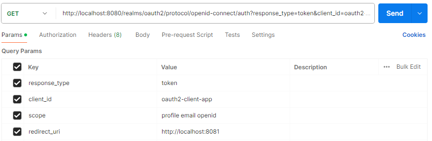

## OAuth 2.0 Grant Types
- Access Token을 발급함으로써 권한부여를 함

### ✨ Authorization Code

- 서버 사이드 어플리케이션에서 많이 사용 함
- 보안에 가장 안전함
- 클라이언트가 인가서버로부터 코드를 받음 (사용자의 승인 및 동의)
  
- 클라이언트가 인가서버에게 코드를 보낸 후
  
- 인가서버로부터 Access Token을 발급 받음

### ✨ Implicit (Deprecated)

- 주로 공개 클라이언트 어플리케이션 (SPA 기반 자바스크립트 앱)에서 사용
- token을 바로 발급해주며 Access Token이 브라우저에 노출
  

### ✨ Resource Owner Password Credentials (Deprecated)

- 사용자의 ID와 password를 통해 권한 부여를 받음
  
- 사용자의 ID와 Password가 브라우저에 노출
- 클라이언트가 인가서버의 사용자 ID, Password를 알고있음
- 보통 신뢰성 높은 자사 어플리케이션에서 사용

### ✨ Client Credentials
- 클라이언트의 ID, Secret만 있으면 인가서버로부터 Token 발급 받음
- 사용자가 없음 (백그라운드에서만 실행되는 어플리케이션 등)

### ✨ Refresh Token
- Authorization Code Type에서 지원
- Access Token 만료 시 Refresh Token으로 Access Token을 재발급 받음

### ✨ PKCE-Enhanced Authrization Code
- Authorization Code Grant Type 과 유사함
- codeExchange : hashed value 인가서버에 전달 후
- codeValue : (해시 되기 전의 값), alg : (해시 알고리즘) 전달

### ✨ parameter type
- 클라이언트가 인가서버에게 권한 부여 요청을 할때 전달하는 파라미터
- client_id : 클라이언트가 인가 서버에 등록 할 때 생성하는 키
- client_secret : Auth server에 등록 된 특정 클라이언트의 client_id에 대한 비밀값
- response_type : code / token / id_token => 서버가 쿼리 문자열에 반환
- grant_type : authorization_code / password  / client_credentials / refresh_token
- redirect_uri : 사용자가 인증에 성공하면, 인가 서버가 리다이렉션
- scope : 접근 범위 지정, profile / email / read / write / ...
- state : CSRF 공격 방지를 위해 사용, 클라이언트가 인가서버에 state를 보내고, 서버가 리다이렉트 할때 state를 받아서 동일한 값인지 확인